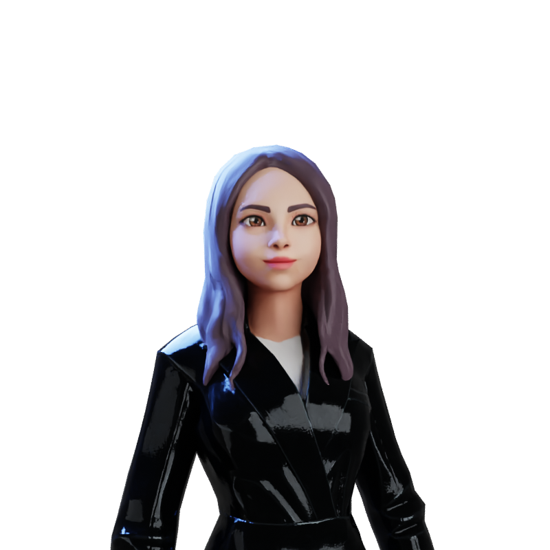

#  Hello World! 👾

Kaylane Moreira ♀️, 19, Fortaleza-CE 🙋‍♀️

Estudante da **JavaScript, React, TypeScript** com foco em aprimorar o meu conhecimento e contribuir sempre que possível .

_✨ Learning is continuous and there will always be a next level!_

### - 📫 Where to Find Me:

<!-- 

&nbsp;&nbsp; -->

&nbsp;&nbsp;

---

### - 🧠 Languages and Tools:

 

<!-- 
 -->

<!-- 
 -->

 
 

---
<!-- ### - 🎵 _"…And be a simple kind of man"_ -->

- 📫 How to reach me: [Linkedin](https://www.linkedin.com/in/kaylanem/)
- 😄 Pronouns: She/Her
- 🌱 I’m currently learning everyday.
- 🥅 2022 Goals: Master Front-End Development
<!-- - 👯 ... -->
<!-- - 💬 ... -->
<!-- - 🔭 ... -->
<!-- - ⚡ Fun fact: ... -->
